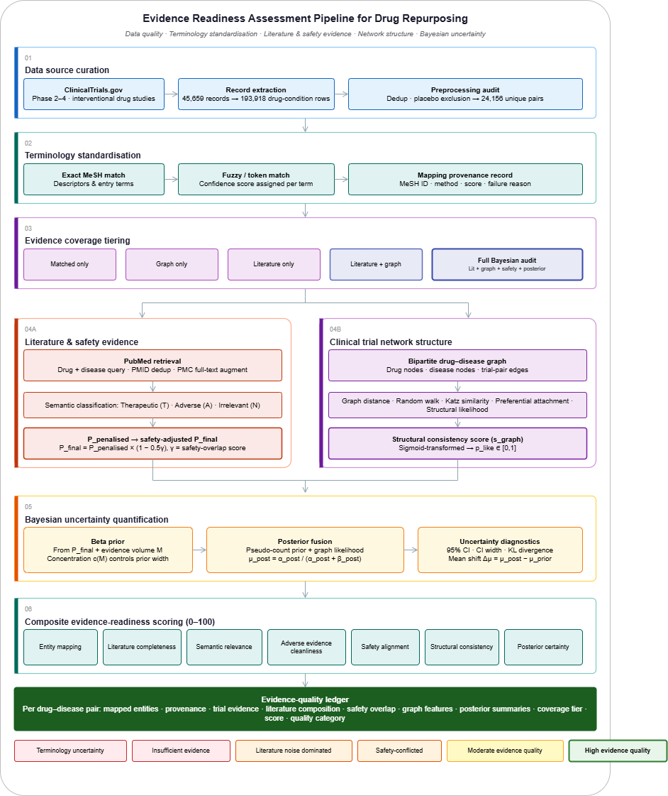

# Evidence-Readiness Network Analysis for Drug Repurposing

This repository implements an auditable drug-repurposing pipeline that combines ClinicalTrials.gov trial structure, MeSH terminology standardisation, interpretable graph features, PubMed/PMC semantic evidence, openFDA safety overlap, and Bayesian uncertainty quantification.

The output is not a clinical efficacy claim. It is an evidence-readiness ledger: a technical audit of whether a drug-disease pair has enough clean, concordant, structurally plausible, and uncertainty-bounded evidence to justify expert review.

## Pipeline Diagram



The diagram summarises the end-to-end publication workflow:

1. ClinicalTrials.gov drug-intervention studies are filtered, deduplicated, and expanded into drug-condition rows.
2. Drug and disease terms are normalised against MeSH descriptors and entry terms.
3. Pairs are assigned an evidence coverage tier: matched only, graph only, literature only, literature plus graph, or full Bayesian audit.
4. Literature and safety evidence are retrieved and semantically classified.
5. A bipartite drug-disease graph produces structural likelihood features.
6. Semantic priors and graph likelihoods are fused into posterior Beta distributions.
7. Composite evidence-readiness scores and rule-based quality categories are written to a per-pair ledger.

## Core Entry Points

| File | Purpose |
| --- | --- |
| `run_full_data_quality_pipeline.py` | Main orchestration script. Creates a dated publication run folder with numbered audit files, ledgers, tables, figures, logs, and validation output. |
| `code/data_extraction.py` | ClinicalTrials.gov v2 API fetcher with paging, retry/backoff, status/phase/intervention filters, cutoff-year filtering, and global NCT de-duplication. |
| `code/condition_drug_pairs.py` | Extracts condition-intervention pairs and maps terms to MeSH using exact, fuzzy, and token-guided matching. |
| `code/network_builder.py` | Builds the bipartite drug-disease graph and computes interpretable graph features for known and unknown pairs. |
| `code/pubmed_utils.py` | Retrieves PubMed records, optionally augments with PMC text, classifies abstracts with an LLM, and constructs literature priors. |
| `code/side_effect_updater.py` | Retrieves openFDA adverse-event terms and applies an LLM-scored safety-overlap penalty to the prior. |
| `code/bayesian_predictor.py` | Fuses literature/safety priors with graph likelihoods using Beta pseudo-count updates and writes run logs/plots. |
| `code/evidence_quality_report.py` | Offline report generator that builds pair-level, source-level, and summary quality tables from existing artifacts. |
| `data_quality/*.py` | Shared metric definitions, composite scoring weights, coverage-tier rules, and quality-flag rules. |
| `reporting/make_all_publication_tables.py` | Generates manuscript and supplementary CSV tables. |
| `visualisation/make_all_publication_figures.py` | Generates publication and supplementary figures. |
| `validation/validate_publication_run.py` | Validates a publication run folder for required structure, ledger columns, panel coverage, tables, figures, and reproducibility snapshots. |

## Repository Layout

```text
.
|-- code/                         # Core extraction, mapping, graph, literature, Bayesian, and utility modules
|-- config/                       # Case-study panels used by publication runs
|-- data_quality/                 # Ledger schema, scoring weights, and rule-based flags
|-- outputs/                      # Dated publication/data-quality rerun folders
|   `-- 20260610_bayesian/        # Latest validated full pipeline run retained after cleanup
|-- pipeline/                     # Pipeline documentation figure
|-- reporting/                    # Publication table generation
|-- validation/                   # Publication run validation
|-- visualisation/                # Publication figure generation
|-- run_full_data_quality_pipeline.py
|-- requirements.txt
`-- README.md
```

## Methodology

### 1. Clinical Trial Extraction

`ClinicalTrialFetcher` queries the ClinicalTrials.gov v2 API by therapeutic area and filters studies locally:

- `overallStatus` in `RECRUITING`, `ACTIVE_NOT_RECRUITING`, `ENROLLING_BY_INVITATION`, `COMPLETED`, `WITHDRAWN`, or `TERMINATED`
- phase intersects `PHASE2`, `PHASE3`, or `PHASE4`
- at least one intervention has type `DRUG`
- reference year is at or before `--cutoff_year` (default `2020`)
- duplicate `NCTId` values are removed globally across therapeutic areas

The publication pipeline writes `01_clinical_trial_extraction_audit.csv` with source-level counts and filtering diagnostics.

### 2. Terminology Standardisation

`ConditionDrugPairBuilder` loads `mesh_data/desc2026.xml` and builds normalised lookup maps from descriptor names and entry terms:

- disease terms are identified from MeSH tree numbers beginning with `C`
- drug terms are identified from MeSH tree numbers beginning with `D`
- incoming terms are cleaned by lowercasing, stripping qualifiers, normalising separators, removing dosage-like tokens, and reducing punctuation
- matching proceeds through exact match, high-confidence fuzzy match, low-confidence fuzzy match, and token-guided Jaccard scoring

In a publication run, mapped pairs are written under `outputs/<run>/processed_data/`; unresolved terms and failure reasons are written to `outputs/<run>/processed_data/unmatched_pairs.json`. The mapping audit is mirrored into `02_terminology_mapping_audit.csv`.

### 3. Graph Construction and Structural Evidence

`InterpretableGraphFeatureBuilder` constructs an undirected bipartite graph:

- drug nodes connect to disease nodes through observed trial pairs
- known pairs receive `Label = 1`
- all unobserved drug-disease combinations are generated as candidate non-edges with `Label = 0`
- the graph is written as GraphML for downstream inspection

For each pair, the graph stage computes five interpretable features:

| Feature | Interpretation |
| --- | --- |
| `GraphDistanceToIndication` | Inverse shortest-path distance from the candidate disease to the drug's known indications. |
| `RandomWalkScore` | Personalized PageRank/random-walk score from the drug to the disease. |
| `StructuralLikelihood` | Product-like centrality signal from drug and disease degree/eigenvector/betweenness centralities. |
| `PreferentialAttachment` | Degree product between drug and disease nodes. |
| `KatzSimilarity` | Matrix-based damped-path similarity using `(I - alpha A)^-1 - I`. |

Outputs inside a publication run:

- `outputs/<run>/graph/bipartite.graphml`
- `outputs/<run>/graph/graph_features_known.csv`
- `outputs/<run>/graph/graph_features_unknown.csv`
- `03_graph_construction_audit.csv` inside publication runs

### 4. Literature Prior and Safety Adjustment

`LLMClassifier.build_semantic_prior()` retrieves PubMed records for each drug-disease pair, deduplicates PMIDs, classifies usable records, and saves classified evidence JSON.

Each record is labelled as:

- `therapeutic`
- `adverse`
- `irrelevant`

Given `T` therapeutic articles, `A` adverse articles, and `M` total classified articles:

```text
p_raw        = T / M
p_penalised  = max((T - 2A) / M, 0)
```

The adverse-evidence coefficient `2` is a pre-specified conservative heuristic: one adverse-classified article is allowed to offset two therapeutic-classified articles before clamping at zero. This intentionally penalises safety-conflicted literature more strongly than mixed neutral evidence.

`SideEffectUpdater` then retrieves openFDA adverse-event terms and asks the LLM whether those terms semantically overlap with the target disease. If a relation exists:

```text
p_final = p_penalised * (1 - penalty_scale * gamma)
```

where `gamma` is the safety-overlap confidence in `[0, 1]` and `penalty_scale` defaults to `0.5`. If no relation is detected, `p_final = p_penalised`.

The safety penalty scale `0.5` is also a pre-specified conservative heuristic. It caps the safety-overlap reduction at 50% when `gamma = 1`, avoiding complete elimination of a signal while still down-weighting candidates whose adverse-event profile overlaps with the target phenotype.

Publication runs write:

- `04_literature_retrieval_audit.csv`
- `05_semantic_classification_audit.csv`
- `06_safety_overlap_audit.csv`

### 5. Bayesian Fusion

The Bayesian stage converts the safety-adjusted literature prior and graph likelihood into Beta pseudo-counts.

Evidence-scaled prior concentration:

```text
c(M) = cmax * (1 - exp(-M / tau))
```

Default values:

```text
cmax               = 200
tau                = 25
likelihood_strength = 50
likelihood_intercept = 0
```

Prior:

```text
alpha_prior = 1 + c(M) * p_final
beta_prior  = 1 + c(M) * (1 - p_final)
```

Graph likelihood:

```text
score  = intercept + sum(weight_i * feature_i)
p_like = sigmoid(score)
```

Default graph-feature weights in `run_full_data_quality_pipeline.py`:

```text
GraphDistanceToIndication =  0.1148
RandomWalkScore           =  0.2470
StructuralLikelihood      = -0.1154
PreferentialAttachment    = -0.0410
KatzSimilarity            =  1.6515
```

Likelihood pseudo-counts:

```text
alpha_like = 1 + likelihood_strength * p_like
beta_like  = 1 + likelihood_strength * (1 - p_like)
```

Posterior fusion subtracts the unit baselines and adds only evidence mass:

```text
alpha_post = alpha_prior + (alpha_like - 1)
beta_post  = beta_prior  + (beta_like  - 1)
posterior_mean = alpha_post / (alpha_post + beta_post)
```

Diagnostics include posterior variance, 95% credible interval, credible-interval width, KL divergence from prior to posterior, and posterior mean shift.

The Bayesian constants above are fixed defaults used by the pipeline and are written to `run_config.json` for each publication run.

### 6. Composite Evidence-Readiness Score

The final 0-100 score is a weighted audit-readiness index, not a treatment recommendation:

```text
score = 100 * (
    0.15 * entity_mapping
  + 0.15 * literature_completeness
  + 0.15 * semantic_relevance
  + 0.10 * adverse_cleanliness
  + 0.15 * safety_alignment
  + 0.15 * structural_consistency
  + 0.15 * posterior_certainty
)
```

Rule-based quality categories include:

- `High evidence quality`
- `Moderate evidence quality`
- `Low evidence quality`
- `Terminology uncertainty`
- `Insufficient evidence`
- `Sparse literature; structurally plausible`
- `Literature noise dominated`
- `Literature-conflicted`
- `Safety-concerning`
- `Safety-conflicted evidence`

Coverage tiers are standardised as:

- `full_bayesian_audit`
- `bayesian_without_safety`
- `literature_and_graph`
- `graph_only`
- `literature_only`
- `matched_pairs_only`
- `insufficient_coverage`

## Main Outputs

The retained full run is `outputs/20260610_bayesian/`. A publication run folder has this structure:

```text
outputs/<run>/
|-- audit_files/
|   |-- 01_clinical_trial_extraction_audit.csv
|   |-- 02_terminology_mapping_audit.csv
|   |-- 03_graph_construction_audit.csv
|   |-- 04_literature_retrieval_audit.csv
|   |-- 05_semantic_classification_audit.csv
|   |-- 06_safety_overlap_audit.csv
|   |-- 07_bayesian_uncertainty_audit.csv
|   |-- 08_full_evidence_quality_ledger.csv
|   |-- 09_quality_category_counts.csv
|   |-- 10_summary_dashboard.csv
|   |-- 11_disease_drug_pair_validation.csv
|   `-- 12_case_study_validation.csv
|-- graph/
|-- ledgers/
|   `-- full_evidence_quality_ledger.csv
|-- logs/
|   |-- run_log.txt
|   `-- requirements_snapshot.txt
|-- manuscript_figures/
|-- manuscript_tables/
|-- supplementary_figures/
|-- supplementary_tables/
|-- run_config.json
|-- validation_checks.csv
`-- validation_report.json
```

The central artifact is:

```text
outputs/<run>/ledgers/full_evidence_quality_ledger.csv
```

Key ledger columns include entity provenance, MeSH IDs, mapping scores, trial counts, literature counts, safety overlap, graph features, prior/posterior summaries, credible intervals, KL divergence, composite readiness score, coverage tier, and final interpretation.

## Installation

Python 3.8+ is expected.

```powershell
py -m venv .venv
.\.venv\Scripts\Activate.ps1
py -m pip install --upgrade pip
py -m pip install -r requirements.txt
```

The Bayesian literature and safety stages require an OpenAI API key. Put it in `.env`:

```text
OPENAI_API_KEY=your_key_here
```

ClinicalTrials.gov, PubMed, PMC, and openFDA are queried over public HTTP APIs. Full reruns therefore require network access.

`code/train_model.py` imports `xgboost`; install it separately if you want to rerun the optional model-comparison training stage.

## MeSH Descriptor File

The mapper expects:

```text
mesh_data/desc2026.xml
```

Download it with PowerShell:

```powershell
New-Item -ItemType Directory -Force -Path mesh_data
Invoke-WebRequest -Uri https://nlmpubs.nlm.nih.gov/projects/mesh/MESH_FILES/xmlmesh/desc2026.xml -OutFile mesh_data\desc2026.xml
```

Or let the full pipeline download it:

```powershell
py run_full_data_quality_pipeline.py --download_mesh true
```

## Running the Pipeline

### Full publication rerun

This refreshes ClinicalTrials.gov extraction, MeSH mapping, graph construction, PubMed/PMC evidence, safety overlap, Bayesian scoring, tables, figures, and validation.

```powershell
py run_full_data_quality_pipeline.py `
  --download_mesh true `
  --run_bayesian true `
  --refresh_literature true `
  --refresh_safety true `
  --output_dir outputs/publication_run_YYYYMMDD
```

### Faster structural/data-quality rerun

This refreshes clinical extraction, mapping, and graph artifacts but reuses existing literature/safety/Bayesian artifacts.

```powershell
py run_full_data_quality_pipeline.py `
  --run_bayesian false `
  --refresh_literature false `
  --refresh_safety false `
  --output_dir outputs/publication_structural_YYYYMMDD
```

### Offline report from existing artifacts

```powershell
py code\evidence_quality_report.py `
  --matched outputs\20260610_bayesian\processed_data\condition_drug_pairs.json `
  --unmatched outputs\20260610_bayesian\processed_data\unmatched_pairs.json `
  --known-graph outputs\20260610_bayesian\graph\graph_features_known.csv `
  --unknown-graph outputs\20260610_bayesian\graph\graph_features_unknown.csv `
  --runs-dir outputs\20260610_bayesian\runs `
  --literature-dir outputs\20260610_bayesian\literatures `
  --output-dir outputs\20260610_bayesian\manuscript_tables
```

### Generate tables or figures manually

```powershell
py reporting\make_all_publication_tables.py `
  --ledger_path outputs\publication_run_YYYYMMDD\ledgers\full_evidence_quality_ledger.csv `
  --audit_dir outputs\publication_run_YYYYMMDD\audit_files `
  --output_dir outputs\publication_run_YYYYMMDD\manuscript_tables `
  --supp_dir outputs\publication_run_YYYYMMDD\supplementary_tables `
  --panel_csv config\case_study_panel_publication.csv
```

```powershell
py visualisation\make_all_publication_figures.py `
  --ledger_path outputs\publication_run_YYYYMMDD\ledgers\full_evidence_quality_ledger.csv `
  --audit_dir outputs\publication_run_YYYYMMDD\audit_files `
  --runs_dir outputs\publication_run_YYYYMMDD\runs `
  --output_dir outputs\publication_run_YYYYMMDD\manuscript_figures `
  --supp_dir outputs\publication_run_YYYYMMDD\supplementary_figures `
  --panel_csv config\case_study_panel_publication.csv
```

### Generate supplementary sensitivity tables

This offline analysis varies `cmax`, `tau`, likelihood strength `lambda`, the adverse-evidence weight, and the safety coefficient by 50% below and above their baseline values. It holds ClinicalTrials.gov, MeSH, PubMed/PMC, safety-gamma, and graph artifacts fixed.

```powershell
py reporting\make_sensitivity_supplement.py `
  --run_dir outputs\20260610_bayesian
```

Outputs:

- `outputs/20260610_bayesian/supplementary_tables/SuppTable_sensitivity_parameter_summary.csv`
- `outputs/20260610_bayesian/supplementary_tables/SuppTable_sensitivity_pair_level.csv`
- `outputs/20260610_bayesian/supplementary_tables/SuppText_sensitivity_analysis.md`

### Validate a publication run

```powershell
py validation\validate_publication_run.py `
  --output_dir outputs\publication_run_YYYYMMDD `
  --panel_csv config\case_study_panel_publication.csv
```

Use `--strict` to return a non-zero exit code when validation errors are present.

## Case-Study Panel

The publication panel is defined in:

```text
config/case_study_panel_publication.csv
```

It includes successful, failed, conflicted, emerging, noisy, and sparse-evidence examples. The panel is used to test whether the evidence-readiness framework distinguishes high-quality repurposing evidence from literature volume, structural plausibility, terminology uncertainty, and safety conflict.

## Validation Philosophy

The validation layer checks reproducibility artifacts and audit completeness rather than model accuracy alone. It verifies:

- required output directories
- `run_config.json`
- run logs and dependency snapshots
- required ledger columns
- duplicate drug-disease rows
- case-study panel coverage
- manuscript tables and figures
- row-count consistency

Warnings are expected when a run intentionally reuses legacy artifacts, lacks fresh literature, lacks safety overlap, or does not include every case-study pair in the active ledger. Errors should be resolved before treating a run as publication-ready.

## Modelling Limitations

The adverse-evidence coefficient `2`, safety penalty scale `0.5`, prior concentration parameters `cmax=200` and `tau=25`, and graph likelihood strength `50` are transparent, pre-specified modelling constants rather than fitted causal parameters. They make the current framework conservative for noisy or safety-conflicted evidence, but future work should quantify sensitivity to alternative adverse-penalty, safety-penalty, prior-concentration, and likelihood-strength settings.

## License

MIT License. See `LICENSE`.

Copyright 2025 Francis Osei.
